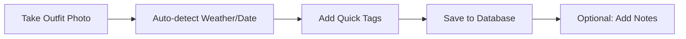
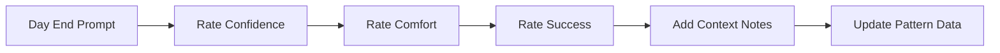

# Style MCP Design Document

## Overview
The Style MCP (Modular Control Protocol) is a personal outfit tracking and recommendation system that helps users optimize their wardrobe choices through data-driven insights and AI-powered suggestions.

## Core System Architecture

### 1. Data Input Layer
- **Photo Capture**: High-quality outfit photos with metadata
- **Manual Entry**: Text-based outfit descriptions
- **Context Logging**: Automatic date, weather, location data
- **Import/Export**: Integration with existing photo libraries

### 2. Tagging & Classification System

#### Primary Tags
- **Occasion**: Work, Casual, Formal, Date, Travel, Exercise, Social
- **Season**: Spring, Summer, Fall, Winter
- **Style**: Minimalist, Bohemian, Classic, Trendy, Edgy, Romantic
- **Mood**: Confident, Comfortable, Playful, Professional, Relaxed
- **Comfort Level**: 1-10 scale
- **Weather Suitability**: Hot, Warm, Cool, Cold, Rainy, Windy

#### Secondary Tags
- **Color Palette**: Primary and accent colors
- **Formality Level**: Very Casual (1) to Very Formal (10)
- **Effort Level**: Low, Medium, High preparation time
- **Versatility**: How many occasions this works for
- **Garment Types**: Specific clothing items worn

### 3. Rating System

#### Confidence Rating (1-10)
- How confident did you feel wearing this outfit?
- Self-perception and social feedback integration

#### Comfort Rating (1-10)
- Physical comfort throughout the day
- Movement restriction, temperature comfort

#### Success Rating (1-10)
- Did the outfit achieve its intended purpose?
- Received compliments, felt appropriate for occasion

#### Repeat Likelihood (1-10)
- Would you wear this exact combination again?

## Workflow Design

### Phase 1: Data Capture


### Phase 2: Evening Reflection


### Phase 3: Pattern Analysis


### Phase 4: Recommendation Generation


## Data Structure Design

### Outfit Entry Schema
```json
{
  "id": "unique_identifier",
  "timestamp": "2024-01-15T08:30:00Z",
  "photos": ["photo1.jpg", "photo2.jpg"],
  "tags": {
    "occasion": ["work"],
    "season": "winter",
    "style": ["classic", "professional"],
    "mood": ["confident"],
    "colors": ["navy", "white", "brown"],
    "garments": ["blazer", "button-down", "trousers", "oxford-shoes"]
  },
  "context": {
    "weather": {
      "temperature": 45,
      "condition": "cloudy",
      "precipitation": false
    },
    "location": "office",
    "duration": "8 hours"
  },
  "ratings": {
    "confidence": 8,
    "comfort": 9,
    "success": 8,
    "repeat_likelihood": 9
  },
  "notes": "Felt very put-together, received compliments",
  "ai_analysis": {
    "style_coherence": 0.92,
    "color_harmony": 0.88,
    "occasion_appropriateness": 0.95
  }
}
```

### User Profile Schema
```json
{
  "user_id": "unique_user_id",
  "preferences": {
    "style_goals": ["professional", "minimalist"],
    "comfort_priorities": ["mobility", "temperature"],
    "color_preferences": ["neutrals", "blues"],
    "avoided_styles": ["overly trendy"],
    "body_type_considerations": "optional_field"
  },
  "wardrobe_inventory": {
    "tops": ["white-button-down", "navy-blazer"],
    "bottoms": ["navy-trousers", "black-jeans"],
    "shoes": ["brown-oxfords", "white-sneakers"],
    "accessories": ["leather-belt", "silver-watch"]
  },
  "size_preferences": {
    "fit_preferences": "tailored",
    "sizes": {"tops": "M", "bottoms": "32x30"}
  }
}
```

## Pattern Analysis Engine

### 1. Success Pattern Detection
- Identify combinations with consistently high ratings
- Correlate weather patterns with successful outfits
- Map occasion-specific winning formulas

### 2. Comfort Analysis
- Track comfort ratings by garment type
- Identify climate-comfort correlations
- Detect improvement trends over time

### 3. Style Evolution Tracking
- Monitor style preference shifts
- Identify expanding comfort zones
- Track confidence growth patterns

### 4. Wardrobe Gap Analysis
- Detect missing occasion coverage
- Identify color palette gaps
- Suggest versatile additions

## AI Integration Strategy

### 1. Computer Vision Analysis
- **Outfit Parsing**: Automatically identify garments and colors
- **Style Classification**: Categorize aesthetic styles
- **Fit Assessment**: Analyze garment fit quality
- **Color Harmony**: Evaluate color combinations

### 2. Pattern Recognition ML Models
- **Personal Style Learning**: Adapt to individual preferences
- **Seasonal Adaptation**: Predict seasonal wardrobe needs
- **Occasion Optimization**: Suggest context-appropriate outfits
- **Trend Integration**: Balance personal style with current trends

### 3. Recommendation Algorithms
```python
def generate_recommendations(context, user_profile, outfit_history):
    # Weight factors
    weather_factor = get_weather_appropriateness(context.weather)
    occasion_factor = get_occasion_match(context.occasion)
    personal_factor = get_style_alignment(user_profile.preferences)
    success_factor = get_historical_success(outfit_history)
    
    # Combine factors for ranking
    recommendation_score = (
        weather_factor * 0.3 +
        occasion_factor * 0.25 +
        personal_factor * 0.25 +
        success_factor * 0.2
    )
    
    return ranked_outfits
```

### 4. Continuous Learning
- User feedback integration
- A/B testing for recommendations
- Seasonal pattern adaptation
- Social trend incorporation

## Implementation Phases

### Phase 1: Core MVP (Months 1-2)
- Basic photo logging
- Simple tagging system
- Manual rating entry
- Basic pattern visualization

### Phase 2: AI Enhancement (Months 3-4)
- Computer vision integration
- Automated tagging suggestions
- Basic recommendation engine
- Pattern analysis dashboard

### Phase 3: Advanced Features (Months 5-6)
- Sophisticated AI recommendations
- Wardrobe gap analysis
- Social features (optional sharing)
- Integration with weather/calendar APIs

### Phase 4: Optimization (Months 7-8)
- Performance optimization
- Advanced analytics
- Personalization refinement
- User experience polish

## Query Interface Design

### Quick Queries
- "Show me my go-to work outfits"
- "What should I wear to dinner tonight?"
- "My most confident outfits this season"
- "Outfits I haven't worn in 3 months"

### Advanced Analytics
- Monthly style reports
- Seasonal wardrobe analysis
- Confidence trend tracking
- ROI analysis for clothing purchases

### Integration Endpoints
- Weather API for daily recommendations
- Calendar integration for occasion planning
- Shopping assistant for gap filling
- Social sharing for feedback

## Privacy & Data Considerations

### Local Data Storage
- Photos stored locally by default
- Encrypted personal preference data
- Optional cloud backup with user consent

### AI Processing
- On-device processing preferred
- Anonymized data for model improvement
- User control over data sharing

### Export Capabilities
- Full data export in standard formats
- Photo library integration
- Backup and restore functionality

## Success Metrics

### User Engagement
- Daily outfit logging frequency
- Rating completion rates
- Recommendation acceptance rates
- Time spent in app

### Style Improvement
- Confidence rating trends
- Outfit success rate improvements
- Wardrobe utilization efficiency
- Purchase decision optimization

### System Performance
- Recommendation accuracy
- AI tagging precision
- Query response times
- User satisfaction scores

This design provides a comprehensive framework for building a Style MCP that evolves with user preferences while providing actionable insights for wardrobe optimization.